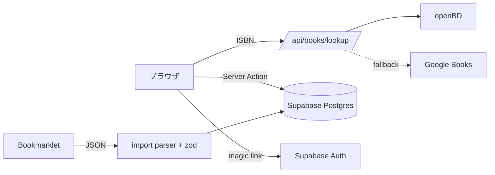

# Architecture / アーキテクチャ

book-recording は、ISBN を起点に読書履歴を記録する個人向け Web アプリです。Next.js 16 (App Router) の単一アプリとして実装され、永続化は Supabase Postgres、認証は Supabase Auth（Email magic link）を使います。

> 背景・差別化方針は [`IDEAS.md`](../../IDEAS.md)、フェーズ計画と設計決定ログは [`plan.md`](../../plan.md) を参照してください。

## 技術選定

| 項目 | 採用 | 理由 |
|---|---|---|
| フレームワーク | Next.js 16 (App Router, Turbopack) + React 19 | URL 設計・OGP・Server Actions が必要なため。Streamlit は URL 設計／OGP 不可で不採用。 |
| スタイル | Tailwind CSS v4 + shadcn/ui (base-ui ベース) | |
| ORM / DB | Drizzle ORM + Supabase Postgres | 型安全なスキーマ定義とマイグレーション。 |
| 認証 | Supabase Auth (`@supabase/ssr`) — Email magic link | パスワードレス、SSR 対応。 |
| バリデーション | zod | 取り込みペイロードの中間表現スキーマに使用。 |
| デプロイ | Vercel 前提 | |

## コンポーネント構成

| コンポーネント | パス | 役割 |
|---|---|---|
| ルートレイアウト / トップ | `src/app/layout.tsx`, `src/app/page.tsx` | 全体レイアウト・テーマ・トースト (`sonner`)。 |
| 書誌ルックアップ API | `src/app/api/books/lookup/route.ts` | `GET /api/books/lookup?isbn=xxx`。書誌取得のエントリポイント。 |
| 認証コールバック | `src/app/auth/callback/route.ts` | Supabase magic link のコールバック処理。 |
| ログイン | `src/app/login/` (`page.tsx`, `login-form.tsx`, `actions.ts`) | magic link 送信。 |
| 本棚一覧 | `src/app/books/page.tsx` | 自分の本棚（要認証）。 |
| 新規登録 | `src/app/books/new/` (`page.tsx`, `new-book-form.tsx`, `actions.ts`) | ISBN 入力 → プレビュー → 登録。 |
| 詳細・編集 | `src/app/books/[isbn]/` (`page.tsx`, `log-form.tsx`, `actions.ts`) | 書誌＋読書ログ編集（★ / 感想 / 公開トグル / 日付）。 |
| 認証ミドルウェア | `src/middleware.ts`, `src/lib/supabase/middleware.ts` | `/books` 配下のリダイレクトガード。 |
| 認証ヘルパ | `src/lib/auth.ts` | Server Action / Server Component で使う `requireUserId()`。 |
| 書誌取得ロジック | `src/lib/books/` (`openbd.ts`, `google-books.ts`, `isbn.ts`, `index.ts`, `types.ts`) | openBD → Google Books フォールバック、ISBN 正規化。 |
| 取り込みパイプライン | `src/lib/import/` (`types.ts`, `parsers/amazon-notebook.ts`) | Phase 2。中間表現スキーマ（zod）と Amazon ノートブックパーサ。 |
| Supabase クライアント | `src/lib/supabase/` (`server.ts`, `client.ts`, `middleware.ts`) | SSR / ブラウザ / middleware 向けクライアント。 |
| DB | `src/db/` (`index.ts`, `schema.ts`) | Drizzle client（Lazy Proxy）とスキーマ。 |
| UI コンポーネント | `src/components/ui/` | shadcn/ui (badge, button, card, dialog, input, label, sonner, table, textarea)。 |
| ブックマークレット | `public/bookmarklet/amazon-notebook.js` | Kindle Web ノートブックをローカルで JSON 化。 |
| マイグレーション | `drizzle/` | `0000_pink_cerise.sql` ほか。 |
| テスト | `tests/` | Vitest ユニットテスト + fixture。 |

## データモデル

`src/db/schema.ts` で定義（Supabase Postgres）。

- **`books`** — ISBN を主キーとする書誌。`title`, `authors[]`, `publisher`, `page_count`, `cover_url`, `source`（`openbd` / `google` / `manual`）, `genre_tags[]`, `exam_tags[]`, タイムスタンプ。
- **`reading_logs`** — ユーザーごとの読書ログ。`user_id`, `isbn`（`books.isbn` を FK 参照）, `status`（`want_to_read` / `reading` / `finished` / `abandoned`）, `started_at`, `finished_at`, `rating`, `review_md`, `is_public`。
- **`highlights`** — ハイライト。`reading_log_id`（`reading_logs.id` を FK 参照、`ON DELETE CASCADE`）, `location`, `text`, `note`。

設計方針として、Phase 1 では 1 user × 1 book = 1 reading_log とし、再読は別レコードで持ちません（将来 `cycle` カラム追加 or 別テーブル化）。

## データフロー

### 書誌登録（Phase 1）

1. ユーザーが `/books/new` で ISBN を入力。
2. クライアントが `GET /api/books/lookup?isbn=xxx`（`src/app/api/books/lookup/route.ts`）を呼ぶ。
3. ルックアップは **openBD 優先 → Google Books フォールバック**（`src/lib/books/`）。和書カバレッジを優先する設計。
4. プレビュー確認後、Server Action（`src/app/books/new/actions.ts`）が `books` / `reading_logs` を upsert。
5. `/books/[isbn]` で ★評価・感想（Markdown）・公開トグル・日付を編集。

### Kindle 取り込み（Phase 2、雛形）

1. `read.amazon.co.jp/notebook` 上でブックマークレット (`public/bookmarklet/amazon-notebook.js`) を実行し、`innerText` のみを使って JSON を生成（完全ローカル動作・Cookie 非参照）。
2. 生成 JSON を取り込みパーサ (`src/lib/import/parsers/amazon-notebook.ts`) が解析。Strict / Lenient / 位置抽出の3段階。
3. zod 中間表現スキーマ (`src/lib/import/types.ts`) で正規化・検証し、`{ source, exported_at, books: [{ asin?, isbn?, title, author?, cover_url?, highlights[] }] }` へ整形。

> 取り込みは「入力アダプタ分離 + 共通正規化」設計。主軸は Web ノートブック (C)、フォールバックに `My Clippings.txt` (A) と HTML メール (D)。サーバー側スクレイピング（Readwise 型）は規約・認証情報・BAN リスクのため不採用。

## 認証フロー

- middleware (`src/middleware.ts`) が `/books` 配下を未認証時にリダイレクト。
- Server Action / Server Component の冒頭で `requireUserId()`（`src/lib/auth.ts`）が再確認する **二重チェック**。
- 環境変数未設定の middleware は素通し（dev 初期セットアップで `/login` にループしないため）。
- リダイレクト先は `NEXT_PUBLIC_SITE_URL` を基準に固定し、オープンリダイレクト / Host Header Injection を防止。

## セキュリティ上の不変条件

- 取り込み中間表現で `cover_url` は http(s) のみ・長さ 2048 以下に制限（`data:` / `javascript:` URI を遮断）。
- text / note / location / title / author に長さ上限、books / highlights 配列に 10,000 件の上限。
- ASIN / ISBN を正規表現で検証。`exported_at` / `highlighted_at` は ISO 8601 datetime。
- 脆弱性報告フローは [`SECURITY.md`](../../SECURITY.md) を参照。

